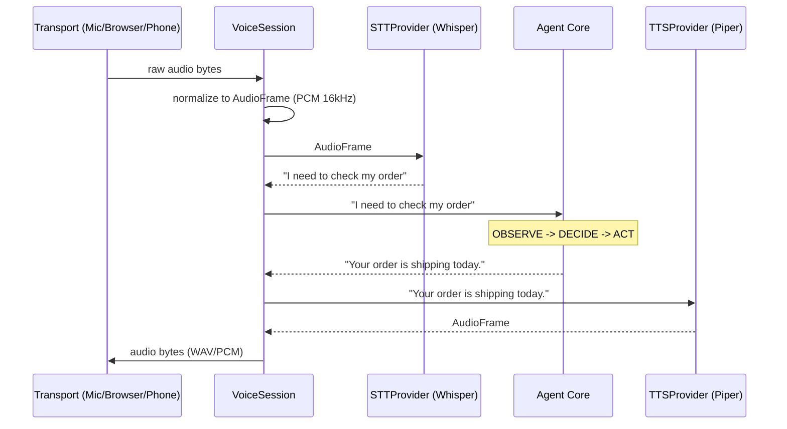

# Voice Architecture

The AI Calling Agent separates the core business logic (Observe→Decide→Act loop) from the voice transport and speech processing. This guarantees that the agent behaves exactly the same whether accessed via CLI, Browser, SIP, or GSM.

## Components

### 1. Agent Core (`app/agent/`, `app/harness/`)
The brain of the system. It receives text `Observation`s, runs the LLM, executes tools, and produces text responses. It does not know about audio, microphones, or phones.

### 2. Voice Pipeline (`app/voice/`)
The bridge between audio I/O and the text-based Agent Core.

- **AudioFrame**: Normalizes all audio internally to PCM 16kHz mono 16-bit.
- **STTProvider**: Converts incoming `AudioFrame` to text. Default is `FasterWhisperProvider` (runs locally, no cloud cost).
- **TTSProvider**: Converts outgoing text to `AudioFrame`. Default is `PiperProvider` (runs locally, natural voices).
- **VoiceSession**: Orchestrates the flow: `Transport → STT → AgentLoop → TTS → Transport`. It maintains the `CallState` across conversation turns.

### 3. Transports (`app/voice/transport/`)
Interfaces that get audio into and out of the system.

- **`LocalTransport`**: Uses your computer's microphone and speakers (via `sounddevice`). Perfect for local development.
- **`WebSocketTransport`**: Streams audio back and forth with a web browser. Used by the Web UI.
- **`SIPTransport` (Architecture Stub)**: Connects to VoIP providers or Asterisk PBX.
- **`GSMTransport` (Architecture Stub)**: Connects to hardware GSM gateways holding physical SIM cards.

## Data Flow

## Telephony Providers

The system is decoupled from Twilio. `TELEPHONY_PROVIDER=twilio` is optional.
By default, `VOICE_TRANSPORT=local` is used, requiring no external providers, phone numbers, or cloud STT/TTS fees.
